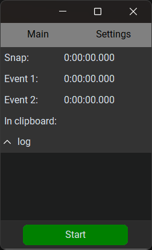
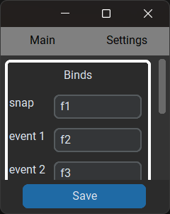

# XInfo Hurry Calc  

## Description  
A Python-based tkinter Tkinter is an application designed to get real-time accurate time in the player (Media Player Classic) and also to calculate the time difference between different moments and put it in the clipboard. 

## Screenshots

    

## Installation


```bash
  git clone https://github.com/DavidDelovoper/timecalc.git
  cd timecalc
```

Installation of pip requirements
```bash
  pip install -r requirements.txt
```
    
## Before launching

Make sure you **enable** port listening in Media Player Classic settings

View > Settings > Web-interface > Port listening
## Compilation to .exe

Simple compilation via PyInstaller
```bash
python -m PyInstaller --onefile --noconsole --clean --distpath "./releases" --name "time-calc3.2" --add-data 'assets/images/arrow.png;assets/images' --add-data 'settings.json;.' --add-data 'default_settings.json;.' app.py
```